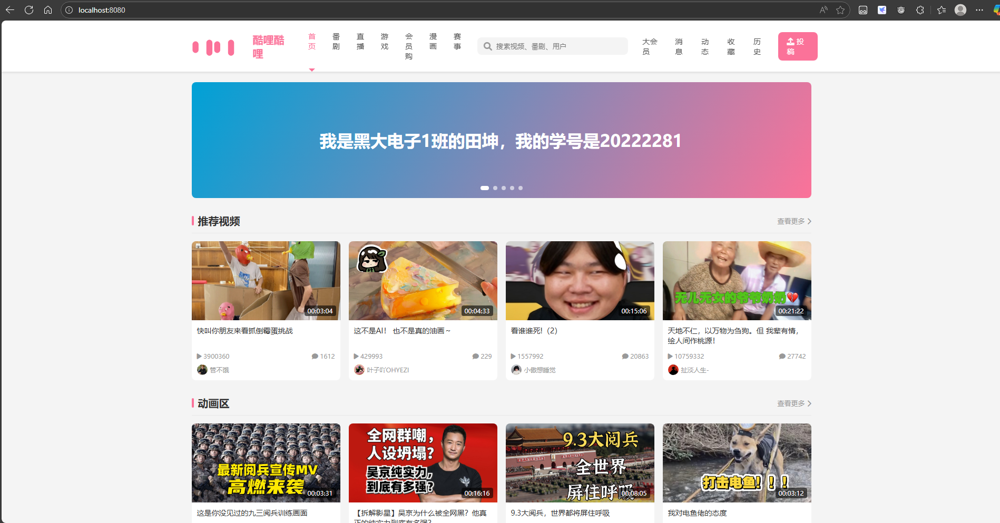

# 🚀 项目运行指南

## 项目状态
✅ 该项目已完成打包，可直接运行

## 数据库说明
📊 用于存储信息的数据库已集成在 `schema.sql` 中（无需单独下载）

## 快速开始

### 1. 下载文件
📦 下载 jar 包文件：`AISpringBoot\target\demo-0.0.1-SNAPSHOT.jar`

### 2. 运行步骤
🔧 按照以下步骤在本地运行程序：

1. 将 `demo-0.0.1-SNAPSHOT.jar` 放到任意位置，记为 `[地址]\demo-0.0.1-SNAPSHOT.jar`
2. 按下 `Win + R` 键，输入 `cmd` 调出控制台
3. 输入 `cd [地址]` 进入 jar 包所在的文件夹
4. 输入 `java -jar demo-0.0.1-SNAPSHOT.jar` 运行程序
5. 打开浏览器，在地址栏输入 `http://localhost:8080/` 访问应用

## 📋 任务目标完成情况

| 任务描述 | 状态 |
|---------|------|
| 构建SpringBoot架构项目 | ✅ |
| 在主页显示个人信息 | ✅ |
| 设计KuliKuli网站(类bilibili) | ✅ |
| 移植KuliKuli至项目主页 | ✅ |
| 在移植后的KuliKuli页面上加入个人信息 | ✅ |
| 个人信息文字段放入数据库 | ✅ |
| 从数据库载入个人信息至主页(挑战) | ✅ |
| 爬取bilibili网站视频信息至数据库 | ✅ |
| 将主页视频卡片随机替换为数据库内信息 | ✅ |
| 设计视频播放页面 | ❌ |
| 交互视频卡片使其可以进入播放页面 | ❌ |
| 从数据库加载播放页面信息 | ❌ |

## 效果预览
🖼️ 运行效果图：

## 💡 注意事项
- 确保本地已安装 Java 运行环境
- 运行前请确认 8080 端口未被占用
- 程序启动后即可通过浏览器访问